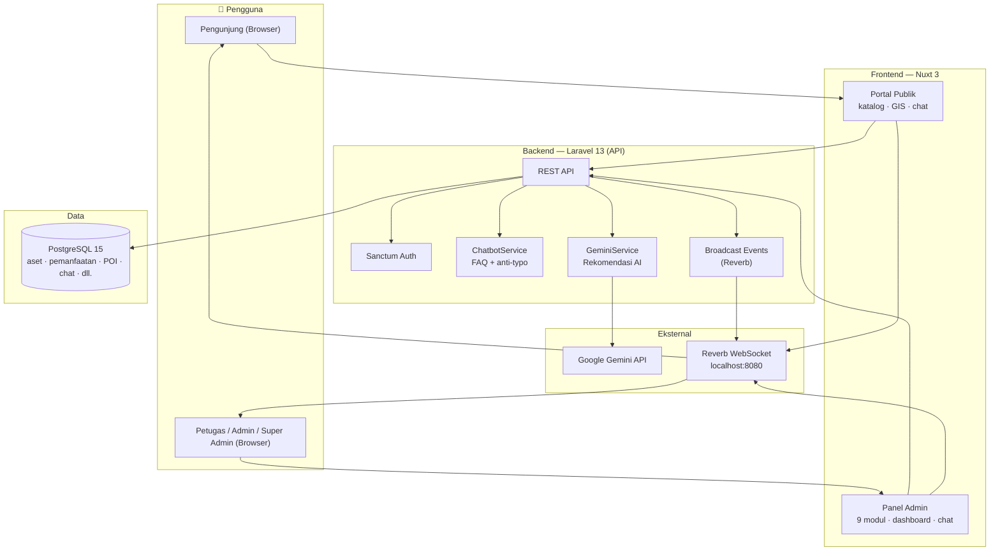
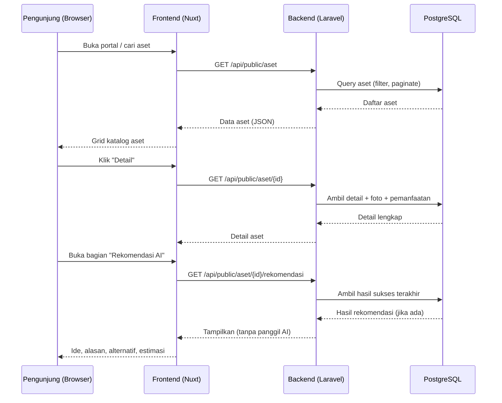
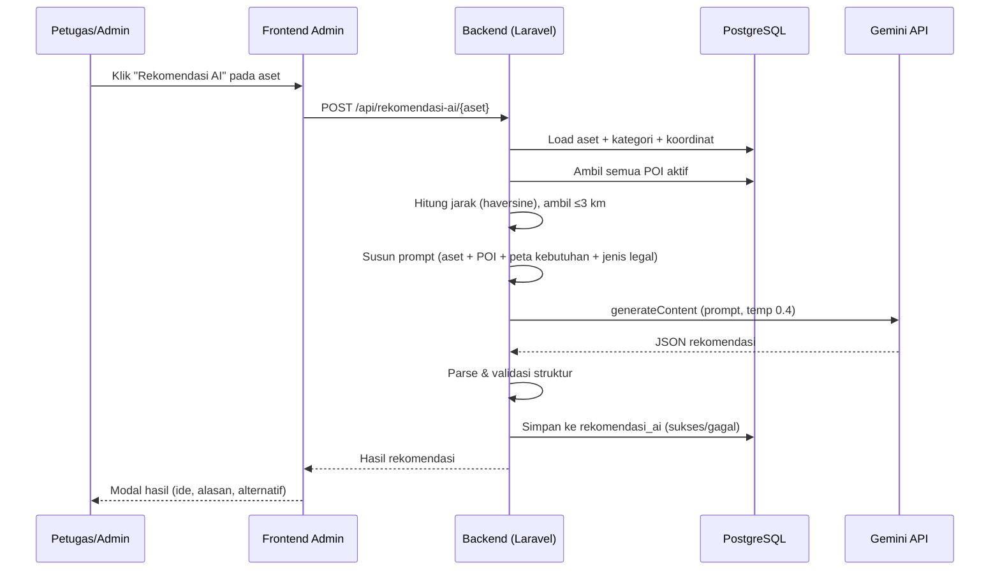
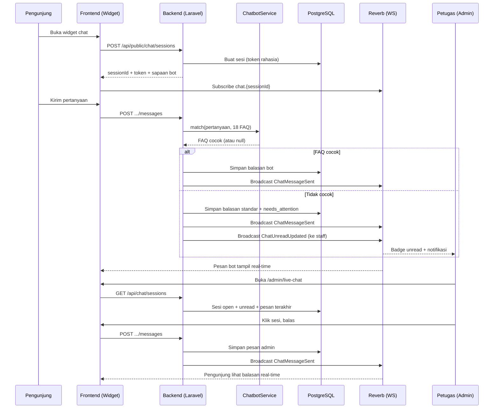
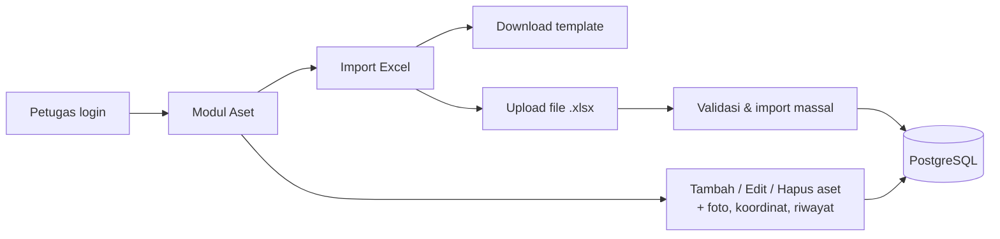
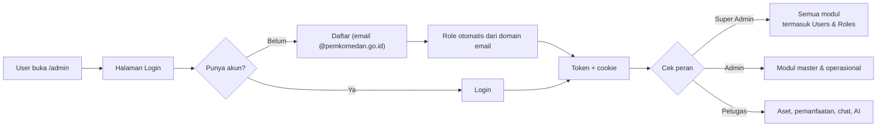
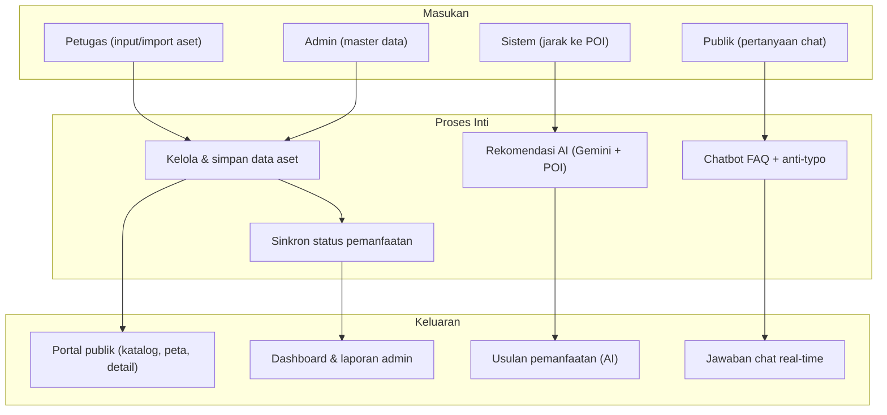

# Data Flow & Arsitektur — PESET

> Diagram arsitektur dan alur data sistem PESET.
> Diagram memakai **Mermaid** — otomatis dirender di GitHub & VS Code (ekstensi *Markdown Preview Mermaid Support*).

---

## 1. Arsitektur Sistem

---

## 2. Alur Publik — Melihat Aset & Rekomendasi

---

## 3. Alur Rekomendasi AI (Tombol di Panel Admin)

**Alur cadangan (fallback):**
- Gemini timeout/error → simpan `status=gagal` + pesan → frontend tampilkan notifikasi error.
- Aset tanpa koordinat → prompt tanpa blok POI (tetap jalan).

---

## 4. Alur Live Chat + Chatbot

**Fallback:** bila WebSocket putus → widget memuat riwayat via fetch + unread via poll (5 detik).

---

## 5. Alur CRUD Aset & Import Excel

---

## 6. Alur Autentikasi & Peran

---

## 7. Alur Data — Ringkasan End-to-End

---
*Selengkapnya: [SRS](./03-srs.md) · [MVP & Roadmap](./05-mvp-roadmap.md)*
